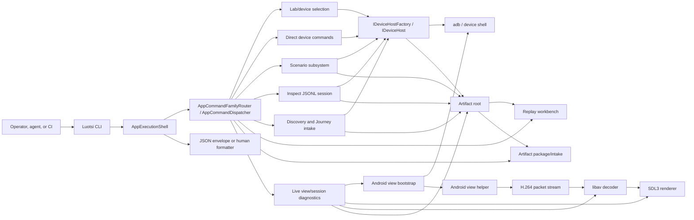

# Architecture Overview

Luotsi is a host-first .NET CLI for Android automation. It drives real
devices through `adb`, keeps device work behind typed host abstractions, and
turns every useful run into structured output plus replayable artifacts. The
product shape is intentionally conservative: one-shot commands return a single
JSON envelope, long-running sessions stream JSONL events, and CI/support
handoffs are files that can be reopened without the original device.

The architecture has grown from "adb plus live view" into a set of cooperating
subsystems:

- command routing and output envelopes
- lab-aware device selection, leases, inventory, and quarantines
- direct Android host actions and semantic telemetry
- scenario authoring, validation, execution, governance, and reports
- inspect/discovery/Journey intake flows for producing reviewed scenarios
- artifact roots, package redaction/intake, run-summary packets, and replay
  workbench commands
- live view bootstrap, decode, rendering, sharing, recording, and diagnostics
- installer/update metadata and native dependency probing

## Top-Level Flow

## Command Runtime

`Luotsi.Cli/Cli/` is the command boundary. `App` builds the composed runtime,
`CliOptions` parses the command line, and `AppExecutionShell` coordinates
dispatch, output formatting, exit-code selection, and failure responses.

The main command services are registered through `LuotsiServiceCollection`:

- `AddLuotsiInfrastructure` wires filesystem, environment, process runner,
  time, console, IDs, ADB/device factories, resilience pipelines, and build
  provenance.
- `AddLuotsiScenarioRunner` wires scenario authoring, validation, execution,
  governance, lab state, reports, leases, quarantines, and inventory.
- `AddLuotsiReplayWorkbench` wires replay open/search/timeline/scrub/capsule,
  graph, cluster, and scenario-draft services.
- `AddLuotsiViewRuntime` wires doctor, view setup/diagnostics, inspect, view
  sessions, FFmpeg setup, and profile coordination.
- `AddLuotsiCommandRouting` wires the family router, command dispatchers,
  artifact commands, discovery, Journey intake, update, and envelope writers.

One-shot commands return exactly one final envelope on stdout unless the caller
chooses human or quiet console modes. Envelope fields use snake_case externally;
internal C# records and persisted JSON artifacts use the repo's normal
serializer policy for their specific contracts.

Long-running modes are different by design:

- `inspect` is a JSONL request/response session for agents.
- `view` is an operator session that prints human progress by default and can
  stream JSONL with `-o jsonl`, `--output jsonl`, or `--json`.
- both session families write timelines into the artifact root so replay can
  analyze what happened later.

## Lab And Device Selection

Device control is not just `--device <serial>` anymore. The lab subsystem under
`Luotsi.Cli/Cli/Routing/` and `Luotsi.Cli/Scenarios/` owns:

- `--device-query` selection and explanation
- durable lab inventory metadata: pools, capabilities, and owners
- device leases and fair queued claims
- quarantine state for unhealthy devices
- device health summaries surfaced through scenario reports
- lab probes and retry counts for diagnostics

`lab status`, `lab doctor`, `lab plan`, `lab claim`, `lab release`, `lab
extend`, `lab quarantine`, `lab inventory`, and scenario `run --claim-device`
all share the same selection contract. This matters for CI and shared labs:
ready handoff commands should prefer a claimed run path when a concrete or
query-selected device is available, and blocked plans should explain capacity,
queue depth, and suggested wait time rather than sending an operator straight
to a fragile direct run.

## Android Host Runtime

`IDeviceHost` is the automation seam. The command layer asks for host actions;
the Android host implementation translates those actions into bounded `adb`
work.

Key ownership:

- `Luotsi.Cli/Infrastructure/Contracts/` defines host-facing contracts,
  process results, filesystem/environment abstractions, and device primitives.
- `Luotsi.Cli/Infrastructure/Devices/` owns device inventory parsing,
  selection support, and host factory plumbing.
- `Luotsi.Cli/Hosts/Android/` owns ADB execution, device readiness, UI
  interaction, screen capture, app lifecycle, files/ports, telemetry, wireless
  debugging, and failure artifact capture.
- `Luotsi.Cli/Telemetry/` parses `LUOTSI_DEVICE_TELEMETRY` logcat lines.

Safe read-style ADB operations can use retry policies for known transient
transport errors. Mutating actions such as taps, text entry, installs, key
events, pushes, and app state changes are deliberately not retried as blind
replays.

## Scenario Lifecycle

`Luotsi.Cli/Scenarios/` is the executable playbook subsystem.

The lifecycle is:

1. author or generate a scenario (`scenario-init`, `journey-intake
   draft-scenario`, `replay scenario-draft`, or `discover`)
2. validate it statically (`scenario-validate`, `run --validate-only`, or
   `replay scenario-draft --validate`)
3. plan and allocate devices (`run --dry-run`, lab plan/claim, or
   `run --claim-device`)
4. execute through host actions
5. write reports, timelines, artifacts, governance signals, and replay commands
6. reopen failures through replay packet/open/capsule/graph/scrub/cluster

Important services:

- `ScenarioCatalog` discovers scenarios, filters by tag/name/action, and builds
  run plans.
- `ScenarioValidator` and `ScenarioValidationExecutor` perform static checks
  without creating a device host.
- `ScenarioRunOrchestrator`, `ScenarioExecutor`, and
  `ScenarioActionDispatcher` execute playbooks through `IDeviceHost`.
- `ScenarioDeviceAllocator` integrates scenario runs with lab leases,
  quarantines, pools, capabilities, and `--device-query`.
- `ScenarioRunReport*` classes write JSON, JUnit, event JSONL, governance,
  device-health, and CI-policy signals.

Scenarios are intentionally artifact-heavy. Runtime failures should leave enough
screen, hierarchy, log, telemetry, scenario, and report context for replay
commands to diagnose the run without needing to reproduce it immediately.

## Authoring And Exploration

Luotsi has three non-manual paths into reviewed scenario coverage:

- `inspect` lets an agent issue structured commands and receive screen
  snapshots, deltas, command results, and replay timeline events.
- `discover` explores visible UI state under a conservative tap policy,
  persists a discovery map/events/timeline/replay bundle, and emits a
  review-required starter scenario candidate.
- `journey-intake init/validate/draft-scenario` turns Android CLI Journey-style
  intent into a non-executable handoff first, then a review-required evidence
  skeleton after validation.

Replay-based authoring is separate:

- `replay scenario-draft` converts persisted inspect/replay action events into
  a conservative starter scenario.
- with `--validate`, it immediately runs static scenario validation and
  persists validation status beside the draft.
- next actions and capsule summaries surface review, validation, graph audit,
  dry-run, claimed-run, and direct-run handoffs.

The shared rule is that generated scenarios remain review-oriented. Luotsi
promotes evidence, selectors, waits, and provenance, but it does not treat
natural-language intent as an executable assertion without human review.

## Artifacts, Packages, And Replay

The artifact subsystem lives in `Luotsi.Cli/Artifacts/` and the replay workbench
lives in `Luotsi.Cli/Cli/Replay/`.

Artifact roots are the durable product boundary between live device work and
later analysis. They can contain:

- timelines: `session-timeline.jsonl`
- replay metadata: `session-replay.json`
- screen state, hierarchy, screenshots, logcat, telemetry, and recordings
- scenario reports and JUnit
- failure capsules and workbench evidence
- run-summary packets: `run-summary.json` / `run-summary.md`
- package intake summaries: `artifact-intake-summary.json` /
  `artifact-intake.md`
- replay command outputs: open, capsule, timeline, scrub, graph, cluster,
  scenario draft

The current replay entry points are:

- `replay packet` for CI/agent-safe run summaries and `--check` validation
- `replay open` as the front door for one root or the latest root
- `replay capsule` for shareable failure/context summaries
- `replay timeline` and `replay scrub` for ordered event inspection
- `replay graph` for nodes, edges, facts, causal chains, hypotheses, and
  provenance queries
- `replay cluster` for cross-run failure intelligence
- `replay search` for timeline/text artifact search
- `replay scenario-draft` for scenario recovery from recorded actions

Artifact packaging is also part of the architecture, not a side utility:

- `artifacts pack` creates a zip with `luotsi-artifact-package.json`.
- `--redact lab-safe` redacts text-like zip entries only and never mutates the
  source root or binary media.
- `artifacts info` and `artifacts verify` inspect received packages without
  extraction and surface SHA-256 plus lab-safe status.
- `artifacts unpack` validates package manifests, zip entries, lab-safe
  requirements, and optional SHA-256 before writing files.
- `artifacts intake` is the one-command support/CI restore path and can persist
  an intake audit that later replay/capsule commands surface.

This is the contract that lets production teams share evidence with CI,
support, or agents without giving them the original device.

## Live View Runtime

The live mirror spans `Luotsi.Cli/Cli/View/`, `Luotsi.Cli/View/`, and
`Luotsi.Cli/Hosts/Android/View/`.

Runtime path:

1. `ViewSessionCommandPreparer` resolves profile/options/artifact policy.
2. `AndroidViewBootstrap` stages or locates the Android helper, configures the
   ADB tunnel, chooses MediaProjection or `screenrecord`, and starts the helper
   or consent flow.
3. `LocalhostViewStreamConnector` opens the forwarded socket.
4. `ViewPacketStreamReader` parses the private packet protocol.
5. `LibavViewBackend` decodes compressed H.264 into BGRA frames.
6. `NativeWindowViewRenderer` and `Sdl3ViewWindowSurface` present through SDL3.
7. Pointer and keyboard input are routed back through existing host actions so
   live-view input stays aligned with scenario input semantics.

Optional sharing (`--share-bind`) publishes packets to read-only observers and
replays bootstrap packets plus the latest keyframe for late joins. Recording and
screenshots write into the current artifact root.

Diagnostics are first-class:

- `view setup` resolves helper, decoder, backend, and recording prerequisites.
- `view-doctor` reports decoder/helper/backend/preflight/MediaProjection and
  recording readiness.
- `doctor --fix` can stage Luotsi-owned FFmpeg native libraries when published
  repair assets are available.

## Native Dependencies And Distribution

The live renderer uses SDL3 and native FFmpeg/libav through `FFmpeg.AutoGen`.

Resolution order for FFmpeg libraries:

1. `LUOTSI_FFMPEG_ROOT`
2. bundled or repo-local `ffmpeg/bin` candidates
3. app-base candidates in published layouts
4. process/path probing

`ffmpeg/download-ffmpeg.ps1` is the source-checkout helper for staging host
libraries. Published bundles carry the app plus platform-specific native
assets; CI publishes `win-x64`, `linux-x64`, `osx-arm64`, and `osx-x64`
artifacts.

`luotsi version` reports runtime/install metadata and `luotsi update` reruns
the recorded installer path for explicit installs. Luotsi does not silently
auto-update.

## Source Map

Use this map before changing behavior:

| Area | Primary paths |
|---|---|
| CLI composition, routing, envelopes, help | `Luotsi.Cli/Cli/Composition/`, `Luotsi.Cli/Cli/Routing/`, `Luotsi.Cli/Cli/Envelope/`, `Luotsi.Cli/Cli/Help.cs` |
| Quickstart and first-run proof handoff | `Luotsi.Cli/Cli/Routing/QuickstartCommand.cs` |
| Lab/device claims and selection | `Luotsi.Cli/Cli/Routing/Lab*`, `Luotsi.Cli/Scenarios/ScenarioDeviceAllocator.cs`, `Luotsi.Cli/Infrastructure/Devices/` |
| Android host and ADB runtime | `Luotsi.Cli/Hosts/Android/`, `Luotsi.Cli/Infrastructure/Contracts/` |
| Scenario authoring, validation, execution, reports | `Luotsi.Cli/Scenarios/` |
| Inspect sessions | `Luotsi.Cli/Cli/Inspect/` |
| Autonomous discovery | `Luotsi.Cli/Cli/Discovery/` |
| Journey intake | `Luotsi.Cli/Cli/JourneyIntake/`, `examples/journey-intake/` |
| Replay workbench | `Luotsi.Cli/Cli/Replay/`, `docs/replay-graph-schema.md` |
| Artifact roots, indexes, packages, intake | `Luotsi.Cli/Artifacts/`, `docs/schemas/` |
| Live view and sharing | `Luotsi.Cli/Cli/View/`, `Luotsi.Cli/View/`, `Luotsi.Cli/Hosts/Android/View/`, `docs/view-session.md` |
| Telemetry parsing | `Luotsi.Cli/Telemetry/`, `Luotsi.Cli/Infrastructure/Telemetry/` |
| Release/update | `Luotsi.Cli/Cli/Update/`, `docs/distribution-playbook.md` |

## Related Documentation

- [Command reference](commands.md)
- [Subsystems](subsystems.md)
- [Scenario playbooks](scenarios.md)
- [Replay graph schema](replay-graph-schema.md)
- [Artifact package schema](schemas/luotsi-artifact-package-v1.md)
- [Run summary packet schema](schemas/luotsi-run-summary-v1.md)
- [View session](view-session.md)
- [Portable physical lab CI](portable-physical-lab-ci.md)
