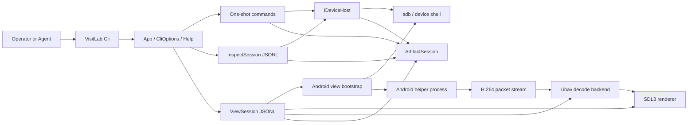
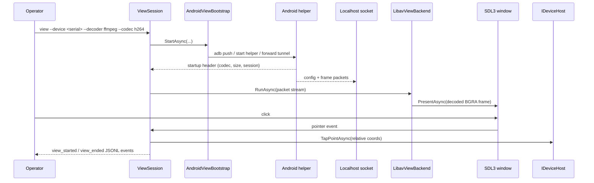

# Architecture Overview

VisitLab is a .NET CLI for driving a real Android device through `adb`,
capturing artifacts by default, and optionally opening a live mirrored view of
the device through the built-in `view` session.

The current architecture is split across three long-lived concerns:

- command execution for one-shot CLI commands
- inspect/view sessions for line-oriented interactive flows
- device-specific Android runtime work behind host abstractions

## Top-level flow

## High-level responsibilities

### Command layer

`VisitLab.Cli/Cli/` owns argument parsing, command dispatch, help text, JSON
envelope formatting for one-shot commands, and JSONL formatting for long-lived
sessions.

### Device host layer

`VisitLab.Cli/Infrastructure/` and `VisitLab.Cli/Hosts/Android/` own host-side
device semantics. The CLI keeps using typed host actions such as tap, text
entry, log reads, screen-state capture, and telemetry collection rather than
inventing a second device-control path.

### Scenario and telemetry layers

`VisitLab.Cli/Scenarios/` executes scenario JSON files through the same host
abstractions. `VisitLab.Cli/Telemetry/` parses semantic telemetry from logcat so
runtime commands and scenarios share the same higher-value oracle path.

### View layer

`VisitLab.Cli/View/` owns the built-in live mirror. The host bootstraps an
Android helper over `adb`, reads the private packet stream from a localhost
tunnel, decodes H.264 through native libav, and presents decoded BGRA frames
through SDL3.

## View runtime data path

## Native dependency story

- The current live decoder is native libav via `FFmpeg.AutoGen`.
- `DEVICE_E2E_FFMPEG_ROOT` can point at a directory containing native FFmpeg
  shared libraries.
- If the environment variable is absent, the runtime probes `ffmpeg/bin` under
  the repo root, under the app base directory, and finally the process path.
- `ffmpeg/download-ffmpeg.ps1` is the DX helper for staging host-native shared
  libraries into `ffmpeg/bin`.
- The SDL3 runtime is already included in current macOS publishes; the FFmpeg
  shared libraries are still external and must be staged separately.

## Current platform shape

- Windows: fully active local development path, including live SDL3 rendering.
- macOS: `osx-arm64` and `osx-x64` cross-publishes now succeed and include
  `libSDL3.dylib`, but live runtime validation on a real macOS host is still an
  active slice rather than a fully confirmed path.
- Linux: packaging and probing are in place for the same libav + SDL3 shape,
  but live operator validation still needs dedicated coverage.

## Source map

- `VisitLab.Cli/Cli/`
- `VisitLab.Cli/Hosts/Android/`
- `VisitLab.Cli/Hosts/Android/View/`
- `VisitLab.Cli/Scenarios/`
- `VisitLab.Cli/Telemetry/`
- `VisitLab.Cli/View/`
- `VisitLab.Cli/Artifacts/`