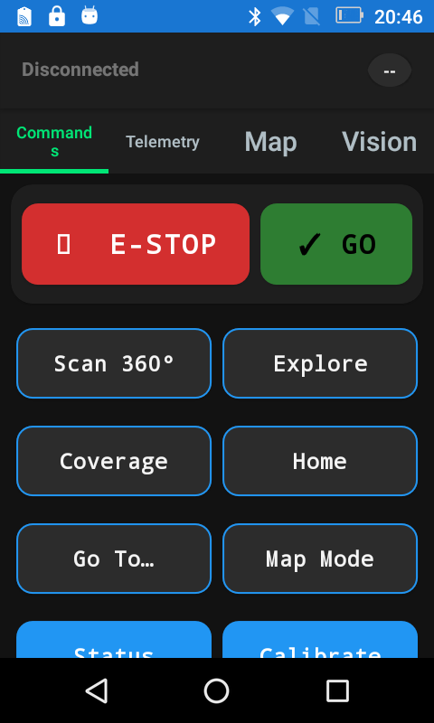
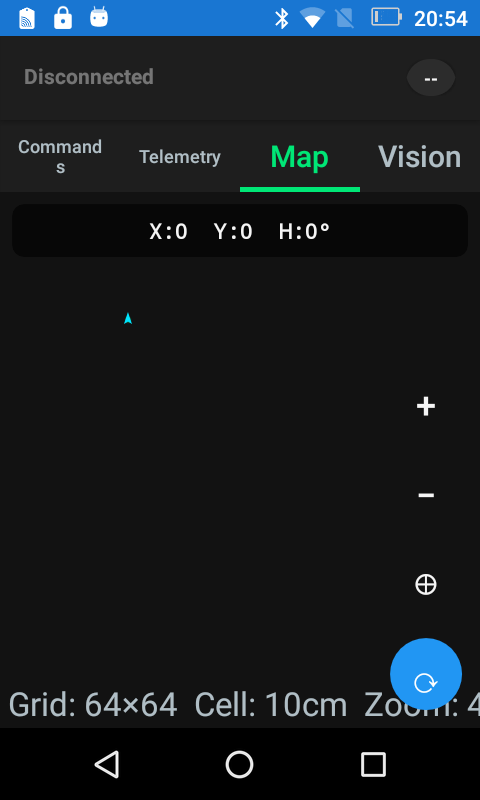
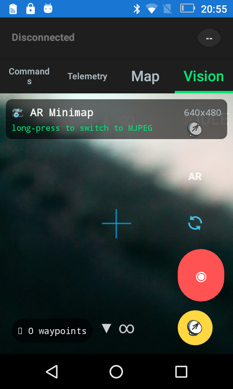
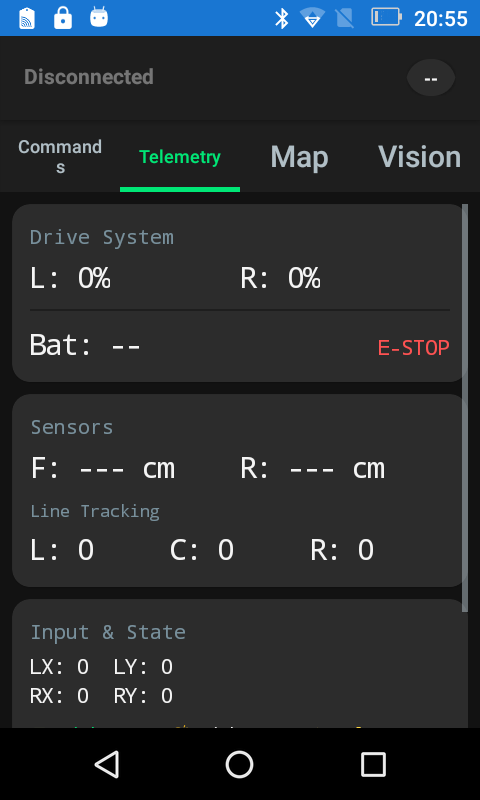

# Live Buggy Controller Demo

This tutorial walks through a real Luotsi run against the Buggy Controller Android app on a USB-connected Android 6 device. The device is old enough to expose rough edges in `uiautomator dump`, which makes it a useful end-to-end demo: Luotsi still records the device, captures screenshots, runs a scenario, emits structured reports, and preserves failure artifacts when screen hierarchy extraction is not available.

The captured app was:

```text
com.digablesolutions.buggycontroller/.MainActivity
```

The captured device was:

```text
0123456789ABCDEF
model=PDA3505
android_release=6.0
sdk=23
abi=armeabi-v7a,armeabi
```

## What You Will Exercise

- Device inventory and readiness: `devices`, `device-status`, `preflight`
- App lifecycle checks: `is-app-installed`, `wait-for-activity`, `force-stop`, `wait-for-not-activity`, `start-app`
- Capture: `record`, `takeScreenshot`, `assertScreenshot`, failure screenshots, logcat
- Scenarios: `scenario-list`, `run --file`, `run --path --dry-run`
- Reports: command envelope JSON, JSONL scenario events, JSON report, JUnit XML
- Diagnostics: ADB server status/version/features/mDNS, forward/reverse add/list/remove, logcat, telemetry watch
- Inspect limitation handling on a legacy Android device

## Prerequisites

- Build Luotsi first if you are running from source: `dotnet build Luotsi.sln`.
- Keep the Buggy Controller app installed on the target device.
- Replace `0123456789ABCDEF` with your own device serial from `luotsi devices`.
- Replace `com.digablesolutions.buggycontroller` if your package name differs.
- Keep the device awake and unlocked. The scenario uses fixed coordinates because this Android 6 device does not provide usable UI hierarchy XML.

The commands below assume you are running from the repository root and use `dotnet run --no-build --no-launch-profile --project Luotsi.Cli -- <command>`. Release users can replace that prefix with `luotsi` or `luotsi.exe`.

## Demo Recording

The deeper run was recorded with Luotsi's host-side `record` command:

```powershell
dotnet run --no-build --no-launch-profile --project Luotsi.Cli -- record `
  --device 0123456789ABCDEF `
  --output .\artifacts\buggy-demo\deep-tour-record.mp4 `
  --time-limit-sec 35
```

<video src="../assets/tutorials/buggy-controller-live-demo/deep-tour-record.mp4" controls width="480"></video>

If your Markdown renderer does not play embedded video, open [`deep-tour-record.mp4`](../assets/tutorials/buggy-controller-live-demo/deep-tour-record.mp4) directly. The shorter first pass is also preserved as [`demo-record.mp4`](../assets/tutorials/buggy-controller-live-demo/demo-record.mp4).

## Captured Outputs

The tutorial includes durable sample outputs from the live run:

| Output | Why it matters |
|---|---|
| [`deep-tour-envelope.json`](../assets/tutorials/buggy-controller-live-demo/outputs/deep-tour-envelope.json) | The single command envelope returned by `run --file`. |
| [`deep-tour-events.jsonl`](../assets/tutorials/buggy-controller-live-demo/outputs/deep-tour-events.jsonl) | Structured scenario lifecycle events. |
| [`deep-tour-report.json`](../assets/tutorials/buggy-controller-live-demo/outputs/deep-tour-report.json) | Machine-readable scenario report with timings, metrics, steps, and artifacts. |
| [`deep-tour-junit.xml`](../assets/tutorials/buggy-controller-live-demo/outputs/deep-tour-junit.xml) | CI-friendly JUnit report. |
| [`telemetry-watch.json`](../assets/tutorials/buggy-controller-live-demo/outputs/telemetry-watch.json) | Bounded telemetry collection showing no semantic events emitted by this app build. |
| [`forward-list-after-add.json`](../assets/tutorials/buggy-controller-live-demo/outputs/forward-list-after-add.json) | Port forward state after adding a host-to-device forward. |
| [`reverse-list-after-add.json`](../assets/tutorials/buggy-controller-live-demo/outputs/reverse-list-after-add.json) | Reverse port state after adding a device-to-host reverse. |
| [`screen-state-failure-envelope.json`](../assets/tutorials/buggy-controller-live-demo/outputs/screen-state-failure-envelope.json) | Structured failure envelope for the Android 6 hierarchy dump issue. |
| [`inspect-failure-transcript.jsonl`](../assets/tutorials/buggy-controller-live-demo/outputs/inspect-failure-transcript.jsonl) | Inspect startup failure transcript for the same hierarchy limitation. |

## 1. Confirm The Device

Start by listing devices and selecting the target serial:

```powershell
dotnet run --no-build --no-launch-profile --project Luotsi.Cli -- devices
```

The live run found both a USB device and a wireless ADB device. The tutorial used the USB device:

```json
{
  "serial": "0123456789ABCDEF",
  "state": "online",
  "type": "physical",
  "model": "PDA3505",
  "availability": "available"
}
```

Then read readiness and focused activity:

```powershell
dotnet run --no-build --no-launch-profile --project Luotsi.Cli -- device-status `
  --device 0123456789ABCDEF
```

The key result was the focused Buggy Controller activity:

```text
mFocusedApp=Token{... com.digablesolutions.buggycontroller/.MainActivity ...}
```

## 2. Preflight The App

Run a preflight check with the package name:

```powershell
dotnet run --no-build --no-launch-profile --project Luotsi.Cli -- preflight `
  --device 0123456789ABCDEF `
  --package com.digablesolutions.buggycontroller
```

Luotsi returned device metadata, foreground focus, package info, fingerprint, ABI, and serial in the standard command envelope.

Check package installation and foreground activity:

```powershell
dotnet run --no-build --no-launch-profile --project Luotsi.Cli -- is-app-installed `
  --device 0123456789ABCDEF `
  --package com.digablesolutions.buggycontroller

dotnet run --no-build --no-launch-profile --project Luotsi.Cli -- wait-for-activity `
  --device 0123456789ABCDEF `
  --activity com.digablesolutions.buggycontroller/.MainActivity `
  --timeout-sec 3
```

Both passed during the live run.

The deeper pass also exercised lifecycle recovery:

```powershell
dotnet run --no-build --no-launch-profile --project Luotsi.Cli -- force-stop `
  --device 0123456789ABCDEF `
  --package com.digablesolutions.buggycontroller

dotnet run --no-build --no-launch-profile --project Luotsi.Cli -- wait-for-not-activity `
  --device 0123456789ABCDEF `
  --activity com.digablesolutions.buggycontroller/.MainActivity `
  --timeout-sec 5

dotnet run --no-build --no-launch-profile --project Luotsi.Cli -- start-app `
  --device 0123456789ABCDEF `
  --package com.digablesolutions.buggycontroller `
  --activity .MainActivity `
  --wait
```

That sequence confirmed Luotsi can stop the target app, observe the launcher taking focus, start the app again, and verify the target activity is foreground.

Sample lifecycle outputs:

- [`force-stop.json`](../assets/tutorials/buggy-controller-live-demo/outputs/force-stop.json)
- [`wait-not-activity.json`](../assets/tutorials/buggy-controller-live-demo/outputs/wait-not-activity.json)
- [`start-app.json`](../assets/tutorials/buggy-controller-live-demo/outputs/start-app.json)
- [`wait-activity-after-start.json`](../assets/tutorials/buggy-controller-live-demo/outputs/wait-activity-after-start.json)

## 3. Capture The Starting Screen

The Buggy app started on the Commands tab:



This is an operator-friendly screen but not a hierarchy-friendly one on this particular Android 6 build. Because text selectors were unavailable, the scenario used coordinate taps and screenshot assertions as the reliable demo path.

Coordinate scenarios should be treated as device-profile-specific. The checked-in scenario declares its expected app, device, and layout metadata so Luotsi can surface non-fatal `metadata_warnings` when a run happens on a different device context. For a different screen size, capture one screenshot first, adjust tab coordinates, then dry-run and execute the scenario.

## 4. Run The Scenario

The scenario is checked in as [`examples/scenarios/buggy-controller-live-demo.json`](../../examples/scenarios/buggy-controller-live-demo.json):

```json
{
  "name": "buggy deep tab tour",
  "tags": ["demo", "live-device", "buggy", "telemetry"],
  "metadata": {
    "package": "com.digablesolutions.buggycontroller",
    "activity": ".MainActivity",
    "notes": "Captured on an Android 6 PDA3505 device; coordinate taps are device-layout-specific.",
    "device": {
      "serial": "0123456789ABCDEF",
      "model": "PDA3505",
      "androidRelease": "6.0",
      "sdk": "23"
    },
    "layout": {
      "width": 1280,
      "height": 720,
      "orientation": "landscape"
    }
  },
  "steps": [
    { "name": "commands before tour", "action": "tapPoint", "label": "Commands tab", "x": 65, "y": 155, "postTapDelayMs": 500 },
    { "name": "commands screenshot", "action": "assertScreenshot", "label": "deep-01-commands", "expectedWidth": 1280, "expectedHeight": 720 },
    { "name": "open telemetry tab", "action": "tapPoint", "label": "Telemetry tab", "x": 170, "y": 155, "postTapDelayMs": 800 },
    { "name": "telemetry screenshot", "action": "takeScreenshot", "label": "deep-02-telemetry" },
    { "name": "open map tab", "action": "tapPoint", "label": "Map tab", "x": 300, "y": 155, "postTapDelayMs": 800 },
    { "name": "map screenshot", "action": "takeScreenshot", "label": "deep-03-map" },
    { "name": "open vision tab", "action": "tapPoint", "label": "Vision tab", "x": 420, "y": 155, "postTapDelayMs": 800 },
    { "name": "vision screenshot", "action": "takeScreenshot", "label": "deep-04-vision" },
    { "name": "return telemetry tab", "action": "tapPoint", "label": "Telemetry tab", "x": 170, "y": 155, "postTapDelayMs": 800 },
    { "name": "telemetry final screenshot", "action": "takeScreenshot", "label": "deep-05-telemetry-final" }
  ]
}
```

Run it with JSONL events plus JSON and JUnit reports:

```powershell
dotnet run --no-build --no-launch-profile --project Luotsi.Cli -- run `
  --file .\examples\scenarios\buggy-controller-live-demo.json `
  --device 0123456789ABCDEF `
  --package com.digablesolutions.buggycontroller `
  --events-jsonl .\artifacts\buggy-demo-events.jsonl `
  --report-json .\artifacts\buggy-demo-report.json `
  --report-junit .\artifacts\buggy-demo-junit.xml `
  --artifacts .\artifacts\buggy-demo `
  --capture-on failure `
  --attach-artifacts always
```

The live run passed:

```json
{
  "scenario": "buggy deep tab tour",
  "status": "passed",
  "metrics": {
    "step_count": 10,
    "passed_step_count": 10,
    "action.assertscreenshot.count": 1,
    "action.takescreenshot.count": 4,
    "action.tappoint.count": 5
  }
}
```

The report and events also captured timing data, step metrics, report provenance, and screenshot artifact references.

In the sample run, the slowest step was a Vision screenshot. That is visible in the JSON report and is the kind of signal Luotsi is meant to surface during developer-loop debugging.

## 5. Review The Scenario Artifacts

Telemetry tab:


Map tab:



Vision tab:



Final Telemetry tab:



This is the core Luotsi workflow: a small JSON playbook drives the device, every step is timed, and screenshots are retained with stable names.

## 6. Discover And Dry-Run The Scenario

Before executing in CI, discover the scenario metadata:

```powershell
dotnet run --no-build --no-launch-profile --project Luotsi.Cli -- scenario-list `
  --path .\examples\scenarios\buggy-controller-live-demo.json
```

The live result reported:

```json
{
  "name": "buggy deep tab tour",
  "tags": ["buggy", "demo", "live-device", "telemetry"],
  "step_count": 10,
  "actions": ["assertScreenshot", "takeScreenshot", "tapPoint"],
  "metadata": {
    "package": "com.digablesolutions.buggycontroller",
    "layout": {
      "width": 1280,
      "height": 720,
      "orientation": "landscape"
    }
  }
}
```

Then generate a deterministic plan without touching the device:

```powershell
dotnet run --no-build --no-launch-profile --project Luotsi.Cli -- run `
  --path .\examples\scenarios\buggy-controller-live-demo.json `
  --dry-run
```

Dry-run is useful for CI sharding and review because it resolves metadata, filters, and selected scenarios without requiring a live device.

## 7. Collect Diagnostics Around The Run

Useful host and device diagnostics:

```powershell
dotnet run --no-build --no-launch-profile --project Luotsi.Cli -- adb server-status --device 0123456789ABCDEF
dotnet run --no-build --no-launch-profile --project Luotsi.Cli -- adb version --device 0123456789ABCDEF
dotnet run --no-build --no-launch-profile --project Luotsi.Cli -- adb features --device 0123456789ABCDEF
dotnet run --no-build --no-launch-profile --project Luotsi.Cli -- adb mdns check --device 0123456789ABCDEF
dotnet run --no-build --no-launch-profile --project Luotsi.Cli -- forward-list --device 0123456789ABCDEF
dotnet run --no-build --no-launch-profile --project Luotsi.Cli -- reverse-list --device 0123456789ABCDEF
dotnet run --no-build --no-launch-profile --project Luotsi.Cli -- list-installed-packages --device 0123456789ABCDEF --third-party
dotnet run --no-build --no-launch-profile --project Luotsi.Cli -- logcat --device 0123456789ABCDEF --tail 40
dotnet run --no-build --no-launch-profile --project Luotsi.Cli -- telemetry-watch --device 0123456789ABCDEF --timeout-sec 3
```

In the live run, `forward-list` showed two active `luotsi_view_*` forwards from the existing view session, and `list-installed-packages --third-party` included `com.digablesolutions.buggycontroller` and `dev.luotsi.view`.

The deeper pass also exercised generic port plumbing:

```powershell
dotnet run --no-build --no-launch-profile --project Luotsi.Cli -- forward `
  --device 0123456789ABCDEF `
  --local tcp:0 `
  --remote tcp:7100

dotnet run --no-build --no-launch-profile --project Luotsi.Cli -- reverse `
  --device 0123456789ABCDEF `
  --remote tcp:7101 `
  --local tcp:7101
```

The added forward was visible in `forward-list` as an allocated host port to `tcp:7100`, then removed with `forward-remove`. The reverse entry was visible in `reverse-list`, then removed with `reverse-remove`. This is useful for app-to-host mock APIs, debug backends, and local service integration.

When using `--local tcp:0`, ADB allocates a host port. Read the returned port from `forward-list` before calling `forward-remove`.

`telemetry-watch` completed successfully but found no `LUOTSI_DEVICE_TELEMETRY` events from this Buggy app build:

```json
{
  "telemetry_line_count": 0,
  "event_count": 0,
  "parse_error_count": 0
}
```

That is still useful signal: Luotsi distinguishes "the command works but the app emits no semantic telemetry" from transport or parser failure.

## Legacy Android Note: Hierarchy Dump Failure

On this Android 6 device, `screen-state` and `inspect` could not parse the UI hierarchy because `uiautomator dump` returned this text instead of XML. The misspelling is verbatim device output:

```text
UI hierchary dumped to: /dev/tty (sic)
```

Luotsi still produced a failure envelope and artifact bundle:


That is useful behavior for CI and live debugging: even when hierarchy extraction fails, the command still returns a structured error and captures evidence. For old devices like this, prefer screenshot-oriented or coordinate-oriented scenarios until hierarchy capture is hardened for `/sdcard/window_dump.xml` style pulls.

## Cleanup

The live tutorial intentionally creates temporary local artifacts and may create temporary port plumbing. Clean up after manual runs:

```powershell
dotnet run --no-build --no-launch-profile --project Luotsi.Cli -- forward-list --device 0123456789ABCDEF
dotnet run --no-build --no-launch-profile --project Luotsi.Cli -- reverse-list --device 0123456789ABCDEF
```

Remove any demo entries you created:

```powershell
dotnet run --no-build --no-launch-profile --project Luotsi.Cli -- forward-remove --device 0123456789ABCDEF --local tcp:<allocated-host-port>
dotnet run --no-build --no-launch-profile --project Luotsi.Cli -- reverse-remove --device 0123456789ABCDEF --remote tcp:7101
```

The checked-in assets under `docs/assets/tutorials/buggy-controller-live-demo/` are examples. New local runs should write to `artifacts/`, which is intentionally ignored by git.

## Takeaways

This tutorial shows the developer-facing shape Luotsi is aiming for:

- Start with inventory and readiness.
- Prepare and verify the target app.
- Record the whole session.
- Run a deterministic scenario plan across Commands, Telemetry, Map, and Vision.
- Keep screenshots, logs, JSONL events, JSON reports, and JUnit reports.
- Exercise operational plumbing such as app lifecycle and port forwarding around the same run.
- Preserve useful artifacts even when an old Android platform cannot provide modern UI hierarchy data.
